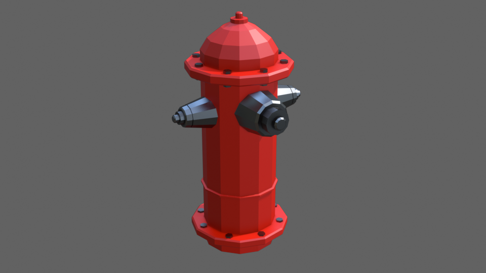
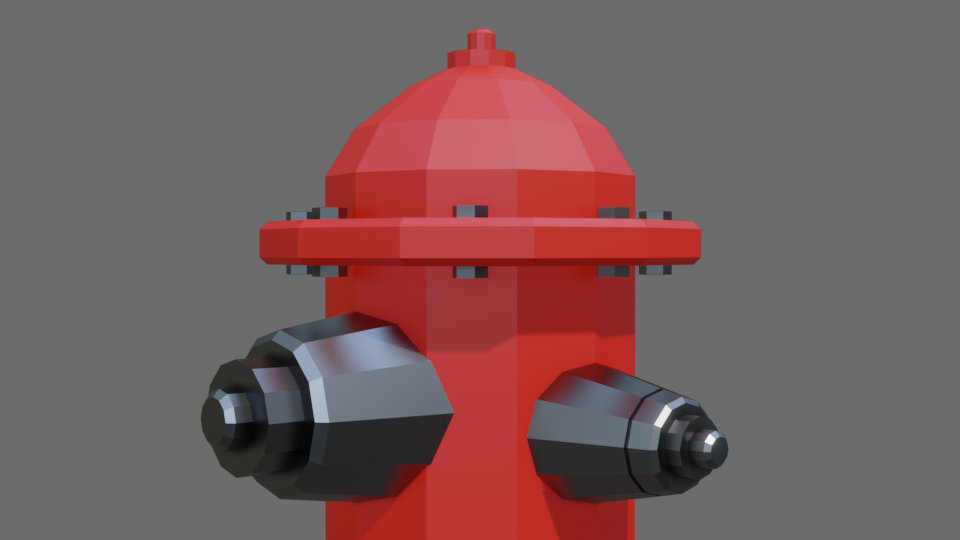

# Low Poly Fire Hydrant

- Tutorial: https://www.youtube.com/watch?v=JACtugRgtLU (fire hydrant)
- Tutorial: https://www.youtube.com/watch?v=aegiN7XeLow (compositing, background in rendered image)

# Notes

- Alt to select a loop of vertex / edge / face
- 1/2/3 for vertex / edge / face selection mode
- Ctrl + R to add a loop cut
- Ctrl + B to add a bevel
- Shift + C to set 3D cursor to world origin
- F to add a face
- G in Object Mode moves the object, G in Edit Mode moves the geometry of that object
- Bolts were rotated using "Transform Pivot Point" > "Individual Origins"
- Normals can be checked using "Viewport Overlays" > "Face Orientation" (blue is forward face, red is backward face)
- Normals can be recalculated in Edit Mode using Shift + N

For the background:

- Compositing > Tick "Use Nodes" > Add "Alpha Over" node in the middle > Set Premultiplied to 1 > Select desired background color in color selection

# Eevee render

